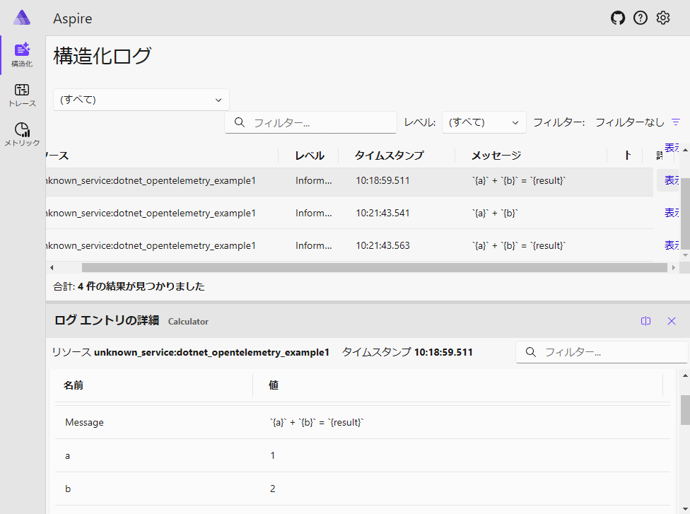

# dotnet_opentelemetry_example1

Getting Started with OpenTelemetry .NET Logs in 5 Minutes - Console Application  
(Google翻訳) 5 分で OpenTelemetry .NET ログを使い始める - コンソール アプリケーション  
https://github.com/open-telemetry/opentelemetry-dotnet/blob/main/docs/logs/getting-started-console/README.md  

```
dotnet new console
dotnet add package OpenTelemetry.Exporter.Console
dotnet add package OpenTelemetry.Exporter.OpenTelemetryProtocol
```

Microsoft Lean - OpenTelemetry を使用した .NET の監視  
https://learn.microsoft.com/ja-jp/dotnet/core/diagnostics/observability-with-otel  


Microsoft Lean - Standalone .NET Aspire dashboard  
https://learn.microsoft.com/en-us/dotnet/aspire/fundamentals/dashboard/standalone?tabs=bash  
```
docker run --rm -it \
    -p 18888:18888 \
    -p 4317:18889 -d \
    --name aspire-dashboard \
    mcr.microsoft.com/dotnet/aspire-dashboard:8.0.0
```
```
# docker logs aspire-dashboard
info: Aspire.Dashboard.DashboardWebApplication[0]
      Aspire version: 8.0.0+7d0dde4108a2640ded4f9787fe28ce0f12d83633
warn: Microsoft.AspNetCore.DataProtection.Repositories.FileSystemXmlRepository[60]
      Storing keys in a directory '/home/app/.aspnet/DataProtection-Keys' that may not be persisted outside of the container. Protected data will be unavailable when container is destroyed. For more information go to https://aka.ms/aspnet/dataprotectionwarning
warn: Microsoft.AspNetCore.DataProtection.KeyManagement.XmlKeyManager[35]
      No XML encryptor configured. Key {XXXXXXXXXXXXXXXXXXXXXXXXXXXXXXXX} may be persisted to storage in unencrypted form.
info: Aspire.Dashboard.DashboardWebApplication[0]
      Now listening on: http://0.0.0.0:18888
info: Aspire.Dashboard.DashboardWebApplication[0]
      Login to the dashboard at http://0.0.0.0:18888/login?t=XXXXXXXXXXXXXXXXXXXXXXXXXXXXXXXXXXXX
info: Aspire.Dashboard.DashboardWebApplication[0]
      OTLP server running at: http://0.0.0.0:18889
warn: Aspire.Dashboard.DashboardWebApplication[0]
      OTLP server is unsecured. Untrusted apps can send telemetry to the dashboard. For more information, visit https://go.microsoft.com/fwlink/?linkid=2267030
```

OTLP Exporter for OpenTelemetry .NET  
https://github.com/open-telemetry/opentelemetry-dotnet/blob/main/src/OpenTelemetry.Exporter.OpenTelemetryProtocol/README.md  

  